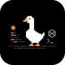

<p align="center">
  
</p>

<h1 align="center">Code Bar</h1>

<p align="center">
  <strong>并行 AI 编程，不再把仓库搞乱。</strong>
  <br>
  一个面向 Claude Code、Codex 和自定义 AI CLI 的桌面工作台。
  <br>
  在多个仓库里并行运行编码会话，为每个会话自动创建独立 git worktree，并在一个界面里查看终端输出、文件和 diff。
  <br><br>
  <a href="./README.md">English</a> | <strong>简体中文</strong>
</p>

<p align="center">
  <a href="https://github.com/For-Tr/Code-Bar/releases/latest"></a>
  <a href="https://github.com/For-Tr/Code-Bar/stargazers"></a>
  <a href="https://github.com/For-Tr/Code-Bar/releases"></a>
  <a href="LICENSE"></a>
</p>

<p align="center">
  <a href="https://github.com/For-Tr/Code-Bar/releases/latest/download/code-bar-windows-x64.msi">Windows</a> ·
  <a href="https://github.com/For-Tr/Code-Bar/releases/latest/download/code-bar-macos-apple-silicon.dmg">macOS Apple Silicon</a> ·
  <a href="https://github.com/For-Tr/Code-Bar/releases/latest/download/code-bar-macos-intel.dmg">macOS Intel</a>
</p>

<p align="center">
  <a href="https://github.com/For-Tr/Code-Bar/releases/latest">下载</a> ·
  <a href="#快速开始">快速开始</a> ·
  <a href="#功能特性">功能特性</a> ·
  <a href="#从源码构建">从源码构建</a> ·
  <a href="https://github.com/For-Tr/Code-Bar/stargazers">Star</a>
</p>

<p align="center">
  
</p>

## 为什么是 Code Bar

AI 编程一旦并行起来，很快就会变乱：终端标签太多、分支互相污染、改动也没有一个顺手的地方统一查看。

Code Bar 把每个任务放进独立 session 和 worktree，让你能并行运行 AI 编程流程，同时保持可控。

- 并行运行多个 AI 编码会话
- 为每个会话自动创建独立 git worktree
- 在一个应用里查看终端输出、文件、SCM 和 diff
- 支持 Claude Code、Codex、自定义 CLI，以及内置 Native Harness
- 会话状态跨重启保留，任务完成后可收到通知

## 适合谁

- Claude Code 和 Codex 的重度用户
- 需要跨多个仓库工作的全栈开发者
- 想更安全地并行使用 AI 辅助编程的开发者
- 希望围绕终端型 AI 工具建立桌面工作流的用户

<p align="center">
  
</p>

## 工作方式

1. 添加一个或多个工作区。
2. 用 Claude Code、Codex、自定义 CLI 或 Native Harness 启动一个 session。
3. Code Bar 为这个 session 自动创建独立的 git worktree。
4. 不离开应用，直接查看终端输出、文件和 diff。

## 快速开始

### 第一步：下载安装

- [Windows x64 MSI](https://github.com/For-Tr/Code-Bar/releases/latest/download/code-bar-windows-x64.msi)
- [macOS Apple Silicon DMG](https://github.com/For-Tr/Code-Bar/releases/latest/download/code-bar-macos-apple-silicon.dmg)
- [macOS Intel DMG](https://github.com/For-Tr/Code-Bar/releases/latest/download/code-bar-macos-intel.dmg)

### 第二步：选择你的 runner

继续使用你已经熟悉的 AI 编程工具：

- **Claude Code**
- **OpenAI Codex**
- **自定义 CLI**
- **Native Harness**：无需外部 CLI，直接访问模型

### 第三步：添加工作区并启动 session

打开你的仓库，创建一个 session，让 Code Bar 为每个任务保持独立 worktree。

## 功能特性

### 并行会话工作流

- 创建和管理多个 AI 编码会话
- 跟踪会话状态：`idle` / `running` / `waiting` / `suspended` / `done` / `error`
- 会话状态跨重启保留
- 任务完成后接收原生通知

### Git worktree 隔离

- 为每个 session 自动创建专属 git worktree
- 让并行 AI 改动彼此隔离，避免分支冲突
- 在应用内查看基于分支的 diff
- 删除 session 时自动清理 worktree

### 应用内审阅与终端

- 每个 session 都有完整的 xterm.js PTY 终端
- 内置文件树和 SCM 侧边栏
- 用 diff2html 进行内联 diff 展示
- 快速切换工作区和 session

### 灵活的 runner 支持

- Claude Code、Codex、自定义 CLI 和 Native Harness 统一管理
- 支持 runner 级 API Key 和 Base URL 覆盖
- Native Harness 支持本地模型 / provider 配置
- 对支持的 CLI 提供应用内安装终端

## 支持的 Runner

| Runner | 说明 |
| --- | --- |
| **Claude Code** | Anthropic 官方 Claude Code CLI（`@anthropic-ai/claude-code`） |
| **OpenAI Codex** | OpenAI Codex CLI（`@openai/codex`） |
| **自定义 CLI** | 接入你自己的 AI CLI 工具 |
| **Native Harness** | 内置 LLM 集成，无需外部 CLI |

## 支持平台

- **macOS**：标准应用激活方式、菜单栏图标，以及原生点击聚焦通知
- **Windows**：托盘模式、PowerShell hook bridge、CLI 路径检测，以及 `.cmd` / `.bat` PTY 兼容处理

## 从源码构建

### 环境要求

- Node.js 18+
- pnpm
- Rust
- 系统依赖：
  - **macOS**：Xcode Command Line Tools
  - **Windows**：Microsoft C++ Build Tools 和 WebView2（见 [Tauri prerequisites](https://v2.tauri.app/start/prerequisites/)）

### 安装

```bash
git clone https://github.com/For-Tr/code-bar.git
cd code-bar
pnpm install
```

### 开发

```bash
pnpm tauri dev
```

如果只跑前端开发服务器：

```bash
pnpm dev
```

### 生产构建

```bash
pnpm build
pnpm tauri build
```

<details>
<summary>开发说明</summary>

当多个 worktree 同时运行 `pnpm tauri dev` 时，Code Bar 会自动选择空闲的 Vite/HMR 端口，并同步更新 Tauri 的 `devUrl`。

</details>

## 贡献

欢迎提交 Issue 和 Pull Request。

1. Fork 本仓库
2. 创建你的功能分支（`git checkout -b feature/amazing-feature`）
3. 提交改动（`git commit -m 'Add amazing feature'`）
4. 推送分支（`git push origin feature/amazing-feature`）
5. 发起 Pull Request

## 许可证

本项目使用 [Apache License 2.0](LICENSE)。

## 作者

[@For-Tr](https://github.com/For-Tr)
